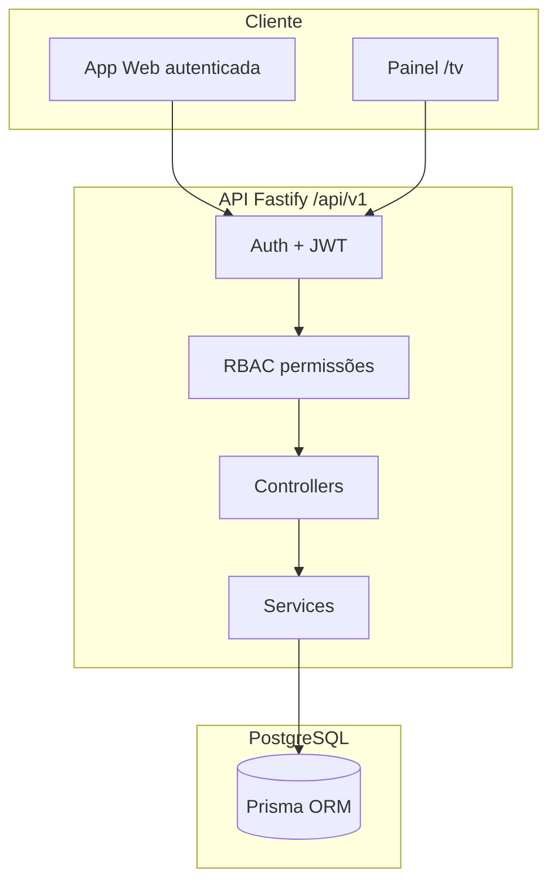
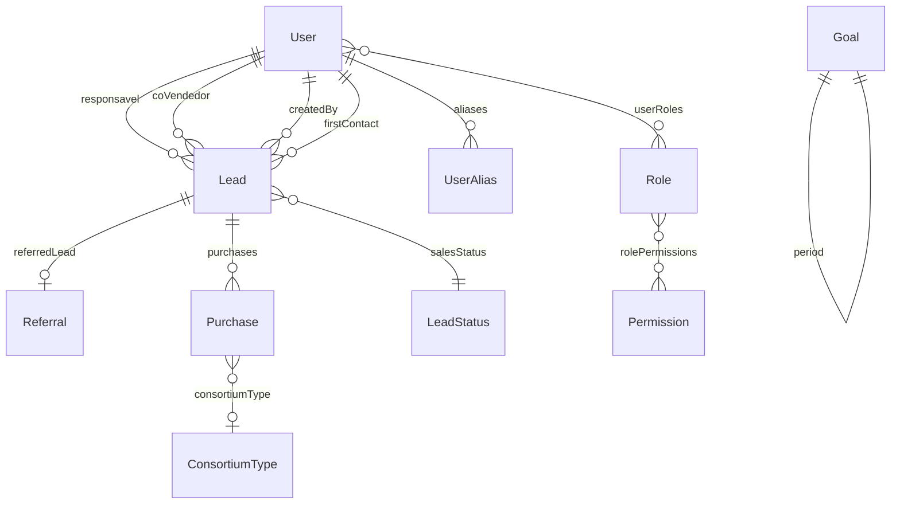

# CAIS Indicações — Mapa do Sistema

Documentação de referência do MVP de **Programa de Indicações para Consórcios**.  
Para setup, deploy e comandos, veja também [`README.md`](./README.md).

---

## 1. Visão geral

O sistema gerencia o ciclo comercial de consórcios com foco em:

- **Leads** (oportunidades comerciais)
- **Indicações** (cadeia USER → LEAD → LEAD…)
- **Vendas** (registro de compras de consórcio)
- **Metas** (global do período + diária da empresa + diária pessoal)
- **Dashboard** (desempenho individual e visão gerencial)
- **Painel TV** (display público para acompanhamento em tempo quasi-real)

### Stack

| Camada | Tecnologia |
|--------|------------|
| Backend | Node.js 20, Fastify 5, Prisma, PostgreSQL 16, Zod, JWT |
| Frontend | TanStack Router/Start, React Query, Tailwind, MUI DataGrid |
| Monorepo | pnpm workspaces (`apps/api`, `apps/frontend`) |
| Deploy | Vercel (frontend) + Docker/VPS (API + Postgres) |

### Arquitetura



---

## 2. Mapa de módulos (frontend)

| Módulo | Rota | Arquivo principal | O que faz |
|--------|------|-------------------|-----------|
| **Login** | `/login` | `apps/frontend/src/routes/login.tsx` | Autenticação e-mail/senha |
| **Cadastro** | `/register` | `apps/frontend/src/routes/register.tsx` | Registro de nova conta |
| **Primeiro acesso** | `/primeiro-acesso` | `apps/frontend/src/routes/primeiro-acesso.tsx` | Definição de senha inicial (usuários criados pelo admin) |
| **Dashboard** | `/dashboard` | `apps/frontend/src/routes/_authenticated/dashboard.tsx` | Abas *Meu desempenho* e *Visão geral* |
| **Leads** | `/leads` | `apps/frontend/src/routes/_authenticated/leads.index.tsx` | CRM: grid, filtros, colunas, import, CRUD |
| **Detalhe do lead** | `/leads/:id` | `apps/frontend/src/routes/_authenticated/leads.$id.tsx` | Ficha, cadeia de bônus, edição, venda |
| **Vendas** | `/vendas` | `apps/frontend/src/routes/_authenticated/vendas.tsx` | Registro de venda + histórico |
| **Indicações** | `/indicacoes` | `apps/frontend/src/routes/_authenticated/indicacoes.tsx` | Relatório de quem indicou quem |
| **Configurações** | `/configuracoes` | `apps/frontend/src/routes/_authenticated/configuracoes/` | Conta, equipe, domínios |
| **Metas** | `/configuracoes/metas` | `.../configuracoes/metas.tsx` | Meta pessoal, período, grade semanal, calendário |
| **Papéis** | `/configuracoes/papeis` | `.../configuracoes/papeis.tsx` | RBAC: papéis e permissões |
| **Painel TV** | `/tv` | `apps/frontend/src/routes/tv.tsx` | Display fullscreen (sem login) |

### Navegação lateral (`AppLayout`)

| Item | Permissão necessária |
|------|---------------------|
| Dashboard | — (todos autenticados) |
| Leads | `leads.view_all` ou `leads.view_own` |
| Registrar Venda | `sales.create` |
| Indicações | `leads.view_all` ou `leads.view_own` |
| Configurações | — (todos autenticados; sub-seções restritas) |

---

## 3. Funcionalidades por módulo

### 3.1 Dashboard

**Arquivos:** `components/cais/dashboard/*`

| Aba | Permissão | Conteúdo |
|-----|-----------|----------|
| **Meu desempenho** | Todos | Meta diária pessoal, KPIs (vendas hoje, leads ativos, taxa de conversão), insight, vendas do dia, leads ativos |
| **Visão geral** | `dashboard.general` | Meta do período, meta do dia (empresa), KPIs globais, funil por status, ranking geral + últimas vendas (mesmos dados da TV) |

### 3.2 Leads

**Arquivos:** `LeadsDataGrid`, `LeadsFilterModal`, `LeadsColumnsModal`, `NewLeadForm`, `EditLeadForm`, `AssignResponsavelDialog`

| Funcionalidade | Detalhe |
|----------------|---------|
| Listagem paginada | Server-side pagination (25/50/100), busca rápida, abas *Todos* / *Sem responsável* |
| Filtros avançados | Modal com operadores por campo (status, datas, valores, etc.) |
| Colunas configuráveis | Modal + persistência em `localStorage` |
| Criar lead | Nome, celular, valor ofertado, indicado por, primeiro contato, vendedor, co-vendedor, grau, status, observações |
| Editar lead | Mesmos campos (sem valor fechado — vem das vendas) |
| Atribuir responsável | Ação rápida na aba *Sem responsável* |
| Excluir lead | Soft-delete; bloqueado se houver vendas (`leads.delete`) |
| Importar Excel | Wizard BASE_CRM: preview de abas, mapeamento de status desconhecidos, relatório detalhado |
| Registrar venda | Atalho no menu de ações (lead não fechado) |

**Colunas da grid (configuráveis):**

Nome, Celular, Oportunidade (`external_code`), Data registro, Criado por, Status, Grau, Valor ofertado, Valor fechado, Vendedor responsável, Primeiro contato, Última atualização, Indicado por, Observações.

### 3.3 Detalhe do lead

| Seção | Conteúdo |
|-------|----------|
| Dados do lead | Nome, celular, oportunidade, valores, indicado por, observações |
| Papéis comerciais | Responsável, co-vendedor, criado por, primeiro contato |
| Cadeia de indicação | Ancestrais (bonus chain) com profundidade configurável |
| Histórico | Criação e última atualização |

### 3.4 Vendas

**Arquivos:** `SaleRegistrationForm`, `SalesAccordionTable`, `ReverseSaleDialog`, `SaleExpandedPanel`

| Funcionalidade | Detalhe |
|----------------|---------|
| Registrar venda | Lead, valor, **data da venda**, tipo de consórcio, co-vendedor |
| Efeitos ao registrar | Lead → status *Fechado*, incrementa `closedAmount`, incrementa meta do período |
| Cadeia de bônus | Retornada após registro (ancestrais na árvore de indicação) |
| Listagem | Tabela acordeão com data, lead, valor, consórcio, **boleto pago** |
| Editar venda | Data da venda e status do boleto (`sales.create`) |
| Cancelar venda | Soft-delete; reverte meta e `closedAmount`; restaura status do lead (`sales.delete`) |
| Importar consórcio | Planilha de campanha (imobiliário/veículo) com mapeamento de vendedores |

### 3.5 Indicações

Tabela flat de todas as relações `referrals`: lead indicado, tipo do indicador (USER/LEAD), nome do indicador.

### 3.6 Metas

**Arquivos:** `PersonalDailyGoalCard`, `PeriodGoalCard`, `WeeklyDefaultsGrid`, `DailyGoalCalendar`

| Tipo | Onde configura | Comportamento |
|------|----------------|---------------|
| **Meta do período** | Configurações / Metas | Valor alvo + período; `currentAmount` incrementa/decrementa com vendas |
| **Meta diária (empresa)** | Grade semanal + calendário | Base por dia da semana; overrides por data; presets (normal, peak, reduced, sprint) |
| **Meta diária pessoal** | Modal onboarding / Metas | Override individual por usuário; usada no dashboard pessoal |

### 3.7 Configurações

| Seção | Permissão | Conteúdo |
|-------|-----------|----------|
| Conta | — | Dados do usuário logado |
| Meta do período | `meta.configure_global` | Editar target e datas |
| Equipe | `users.manage` | CRUD usuários, papéis, forçar primeiro acesso |
| Domínios | `settings.manage` | Status de lead, tipos de consórcio |
| Papéis | `roles.manage` | CRUD papéis + matriz de permissões |

### 3.8 Painel TV (`/tv`)

**Arquivo:** `apps/frontend/src/routes/tv.tsx`

| Bloco | Conteúdo |
|-------|----------|
| Metas | Meta do dia + meta geral (período) com barras de progresso |
| KPIs laterais | Vendas hoje, ticket médio, total recentes, maior venda |
| Ranking geral | Vendas por vendedor no **período da meta** (volume + quantidade) |
| Últimas vendas | Feed das 10 vendas mais recentes |
| Presets | Quick-set de meta do dia (requer `VITE_TV_TOKEN`) |
| Celebração | Confete + som ao detectar nova venda (polling 30s) |

Endpoint público usado: `GET /goals/daily/today` (sem JWT).

---

## 4. Mapa da API

Prefixo global: **`/api/v1`**

### 4.1 Autenticação (`auth.routes.ts`)

| Método | Rota | Auth | Descrição |
|--------|------|------|-----------|
| POST | `/auth/login` | — | Login → JWT |
| POST | `/auth/register` | — | Cadastro |
| POST | `/auth/set-initial-password` | — | Primeira senha |
| GET | `/auth/me` | JWT | Perfil + permissões |

### 4.2 Usuários (`user.routes.ts`)

| Método | Rota | Permissão |
|--------|------|-----------|
| GET | `/users` | JWT |
| POST | `/users` | `users.manage` |
| PATCH | `/users/me/personal-daily-target` | JWT |
| PATCH | `/users/:id/require-password-setup` | `users.manage` |
| DELETE | `/users/:id` | `users.manage` |

### 4.3 Papéis e permissões (`role.routes.ts`)

| Método | Rota | Permissão |
|--------|------|-----------|
| GET | `/permissions/catalog` | JWT |
| GET/POST/PATCH/DELETE | `/roles` | `roles.manage` |
| PUT | `/roles/:id/permissions` | `roles.manage` |
| GET/PUT | `/users/:id/roles` | `users.manage` |

### 4.4 Leads (`lead.routes.ts`)

| Método | Rota | Permissão |
|--------|------|-----------|
| GET | `/leads` | `leads.view_all` / `leads.view_own` |
| POST | `/leads` | `leads.create` |
| GET/PATCH/DELETE | `/leads/:id` | view / edit / `leads.delete` |
| GET | `/leads/:id/tree` | view |
| GET | `/leads/:id/bonus-chain` | view |
| GET | `/leads/import/template` | `leads.import` |
| POST | `/leads/import/preview` | `leads.import` |
| POST | `/leads/import` | `leads.import` |
| GET/POST | `/leads/:leadId/purchases` | `sales.view_all` / `sales.create` |

### 4.5 Vendas globais (`purchase.routes.ts`)

| Método | Rota | Permissão |
|--------|------|-----------|
| GET | `/purchases` | `sales.view_all` |
| PATCH | `/purchases/:id` | `sales.create` |
| DELETE | `/purchases/:id` | `sales.delete` |
| POST | `/purchases/import/preview` | `leads.import` |
| POST | `/purchases/import` | `leads.import` |

### 4.6 Metas (`goal.routes.ts`)

| Método | Rota | Auth | Permissão |
|--------|------|------|-----------|
| GET | `/goals/daily/today` | — | Público (TV) |
| POST | `/goals/daily/today/preset` | Token TV | Quick-set preset |
| GET | `/goals/current` | JWT | — |
| PATCH | `/goals/:id` | JWT | `meta.configure_global` |
| GET | `/dashboard/summary` | JWT | — |
| GET/PUT | `/goals/daily/defaults` | JWT | `meta.configure_day` |
| GET/PUT/DELETE | `/goals/daily/overrides/:date` | JWT | `meta.configure_day` |

### 4.7 Dashboard pessoal (`dashboard.routes.ts`)

| Método | Rota | Descrição |
|--------|------|-----------|
| GET | `/dashboard/personal` | KPIs, meta, ranking, vendas e leads do usuário |

### 4.8 Indicações (`referral.routes.ts`)

| Método | Rota | Descrição |
|--------|------|-----------|
| GET | `/referrals` | Lista flat de todas as indicações |

### 4.9 Domínios (`settings.routes.ts`)

| Método | Rota | Permissão |
|--------|------|-----------|
| GET | `/settings/lookups` | JWT |
| CRUD | `/settings/lead-statuses` | `settings.manage` |
| CRUD | `/settings/consortium-types` | `settings.manage` |

### 4.10 Health

| Método | Rota | Descrição |
|--------|------|-----------|
| GET | `/health` | Status + conexão DB |

---

## 5. Modelo de dados



### Entidades principais

| Entidade | Tabela | Campos relevantes |
|----------|--------|-------------------|
| **User** | `users` | nome, e-mail, senha, meta diária pessoal, soft-delete |
| **UserAlias** | `user_aliases` | apelidos para resolver nomes em importações |
| **Lead** | `leads` | oportunidade (`external_code`), status, grau, valores, papéis comerciais |
| **Referral** | `referrals` | 1 indicador por lead (USER ou LEAD) |
| **Purchase** | `purchases` | venda: valor, data, tipo consórcio, boleto pago, soft-delete |
| **Goal** | `goals` | meta global do período |
| **MetaDailyDefault** | `meta_daily_defaults` | valor base por dia da semana |
| **MetaDailyOverride** | `meta_daily_overrides` | override ou preset por data |
| **LeadStatus** | `lead_statuses` | domínio de status comercial |
| **ConsortiumType** | `consortium_types` | Imóvel, Automóvel, etc. |

### Enums

| Enum | Valores |
|------|---------|
| `ReferrerType` | USER, LEAD |
| `OpportunityGrade` | BAIXO, MEDIO, ALTO, EXTREMO |

### Papéis comerciais no lead

| Campo | Significado |
|-------|-------------|
| `responsavel` | Vendedor responsável pelo lead |
| `coVendedor` | Co-vendedor |
| `createdBy` | Quem cadastrou o lead (manual) |
| `firstContact` | Quem fez o primeiro contato |
| `referrer` | Quem indicou (tabela `referrals`, separada) |

---

## 6. RBAC — Permissões

Catálogo em `apps/api/src/constants/permissions.ts`.

| Grupo | Chave | Label |
|-------|-------|-------|
| Leads | `leads.view_all` | Ver todos os leads |
| Leads | `leads.view_own` | Ver somente seus leads |
| Leads | `leads.create` | Criar lead |
| Leads | `leads.edit_all` | Editar qualquer lead |
| Leads | `leads.edit_own` | Editar somente os seus |
| Leads | `leads.delete` | Excluir lead |
| Leads | `leads.import` | Importar leads (Excel) |
| Vendas | `sales.create` | Registrar venda |
| Vendas | `sales.view_all` | Ver todas as vendas |
| Vendas | `sales.delete` | Cancelar venda |
| Metas | `meta.configure_day` | Configurar meta do dia |
| Metas | `meta.configure_global` | Configurar meta global |
| Dashboard | `dashboard.general` | Visão geral da empresa |
| Dashboard | `tv.view` | Acessar painel TV |
| Admin | `users.manage` | Gerenciar usuários |
| Admin | `roles.manage` | Gerenciar papéis |
| Admin | `settings.manage` | Gerenciar domínios |

### Papéis de sistema (seed)

| Papel | Permissões |
|-------|------------|
| **Administrador** | Todas (17) |
| **Colaborador** | leads (view/create/edit/import), sales (create/view), dashboard.general, tv.view |

---

## 7. Fluxos de negócio

### 7.1 Ciclo do lead

```
Criar/Importar → Atribuir responsável → Acompanhar status → Registrar venda → Fechado
```

- Status *Fechado* é aplicado automaticamente ao registrar venda.
- `closedAmount` no lead é a soma das vendas ativas.
- Valor fechado **não** é editável no formulário de lead — apenas via vendas.

### 7.2 Indicações

- Cada lead tem **no máximo 1 indicador** (`referrals.referred_lead_id` unique).
- Indicador pode ser **USER** (consultor) ou **LEAD** (outro lead).
- Árvore recursiva: ancestrais (quem indicou) e descendentes (quem foi indicado).
- **Cadeia de bônus**: sobe a árvore até profundidade máxima (default 10).

### 7.3 Importação de leads (BASE_CRM)

1. Upload `.xlsx` / `.xls`
2. Detecção automática da aba `BASE_CRM` (ou equivalente)
3. Preview: abas, valores desconhecidos de status
4. Mapeamento manual de status não reconhecidos
5. Deduplicação por `external_code` ou telefone
6. Relatório: criados, atualizados, ignorados, erros

**Colunas mapeadas:** ID, data registro, nome, telefone, responsável, status, observações, valor ofertado, valor fechado, grau, última atualização.

### 7.4 Importação de consórcio (campanha)

1. Upload planilha de campanha (seções Imobiliário / Veículo)
2. Informar data da campanha
3. Preview + mapeamento de nomes de vendedores → usuários (via aliases)
4. Cria leads (por nome) e vendas vinculadas

### 7.5 Metas e vendas

- Ao **registrar venda**: incrementa `goals.currentAmount` do período vigente na data da venda.
- Ao **cancelar venda**: decrementa meta na data original da venda.
- Ao **alterar data da venda**: decrementa na data antiga, incrementa na nova.

### 7.6 Exclusões (soft-delete)

| Entidade | Comportamento |
|----------|---------------|
| Lead | `deletedAt` preenchido; some das listagens |
| User | Soft-delete; validação de vínculos em leads |
| Purchase | Soft-delete; reverte meta e `closedAmount` |

**Regra:** lead com vendas ativas **não pode** ser excluído.

---

## 8. Estrutura de pastas

```
Cais-Indicacoes/
├── apps/
│   ├── api/                          # Backend
│   │   ├── prisma/
│   │   │   ├── schema.prisma         # Modelo de dados
│   │   │   ├── seed.ts               # Seed (domínios + RBAC + admin)
│   │   │   └── migrations/           # 0001–0013
│   │   └── src/
│   │       ├── routes/               # Rotas HTTP
│   │       ├── controllers/          # Validação + HTTP
│   │       ├── services/             # Regras de negócio
│   │       ├── schemas/              # Zod
│   │       ├── middlewares/          # Auth + RBAC
│   │       ├── constants/            # Permissões
│   │       └── utils/                # Helpers
│   └── frontend/                     # Frontend
│       └── src/
│           ├── routes/               # Páginas (TanStack Router)
│           ├── components/cais/      # Componentes de negócio
│           ├── components/ui/        # shadcn/ui
│           └── lib/
│               ├── cais-api.ts       # Cliente API (por domínio)
│               ├── api/auth.ts       # Autenticação
│               ├── leads-filters.ts  # Filtros avançados
│               └── leads-columns.ts  # Colunas da grid
├── docker/                           # Compose dev/prod
├── Doc/                              # Docs de produto e referências
├── README.md                         # Setup e deploy
└── DOCUMENTACAO.md                   # Este arquivo
```

### Serviços backend (por domínio)

| Serviço | Responsabilidade |
|---------|------------------|
| `auth.service` | Login, registro, senha inicial |
| `user.service` | CRUD usuários, meta pessoal |
| `permission.service` | RBAC runtime, guards de lead |
| `lead.service` | CRUD leads, filtros |
| `leadImport.service` | Importação BASE_CRM |
| `consorcioImport.service` | Importação campanha consórcio |
| `purchase.service` | Vendas, metas, bônus |
| `referral.service` | CRUD indicação |
| `referralTree.service` | Árvore recursiva |
| `bonusChain.service` | Cadeia ascendente |
| `referralList.service` | Listagem flat |
| `goal.service` | Meta global do período |
| `dailyGoal.service` | Metas diárias, ranking TV, resumo do dia |
| `dashboard.service` | Dashboard pessoal + resumo |
| `lookup.service` | CRUD status de lead |
| `consortiumType.service` | CRUD tipos de consórcio |
| `domainResolver.service` | Resolução de status na importação |
| `userResolver.service` | Resolução de vendedores via aliases |

---

## 9. Variáveis de ambiente

| Variável | Onde | Uso |
|----------|------|-----|
| `DATABASE_URL` | API | Conexão PostgreSQL |
| `JWT_SECRET` | API | Assinatura de tokens |
| `CORS_ORIGIN` | API | Origem permitida (frontend) |
| `SEED_ADMIN_EMAIL` | API | E-mail do admin (seed) |
| `SEED_ADMIN_PASSWORD` | API | Senha do admin (seed) |
| `VITE_API_URL` | Frontend | URL da API em produção |
| `VITE_TV_TOKEN` | Frontend | Token para presets na TV |
| `VITE_TV_SOUND` | Frontend | Preset de som da celebração |

---

## 10. Histórico de migrations (resumo)

| # | Descrição |
|---|-----------|
| 0001 | Schema inicial |
| 0002 | Lookups (status, origens — origens removidas depois) |
| 0003 | Tipos de consórcio |
| 0004 | Metas diárias |
| 0005 | Meta diária pessoal |
| 0006 | RBAC completo |
| 0007 | Papéis comerciais (responsável, co-vendedor) |
| 0008 | Soft-delete + limpeza de campos legados |
| 0009 | Aliases de usuário |
| 0010 | Flag `must_change_password` |
| 0011 | Criado por, primeiro contato, boleto pago |
| 0012 | Rename meeting → first_contact |
| 0013 | Grau de oportunidade |

---

## 11. Documentação complementar

| Arquivo | Conteúdo |
|---------|----------|
| [`README.md`](./README.md) | Setup, Docker, deploy Vercel/VPS |
| [`Doc/projeto.md`](./Doc/projeto.md) | Especificação de produto e mapeamento BASE_CRM |
| [`Doc/Referências/`](./Doc/Referencias/) | Planilhas e materiais de referência |
| [`apps/frontend/src/routes/README.md`](./apps/frontend/src/routes/README.md) | Convenções de roteamento |

---

*Última atualização: junho/2026 — reflete o estado atual do repositório `main`.*
